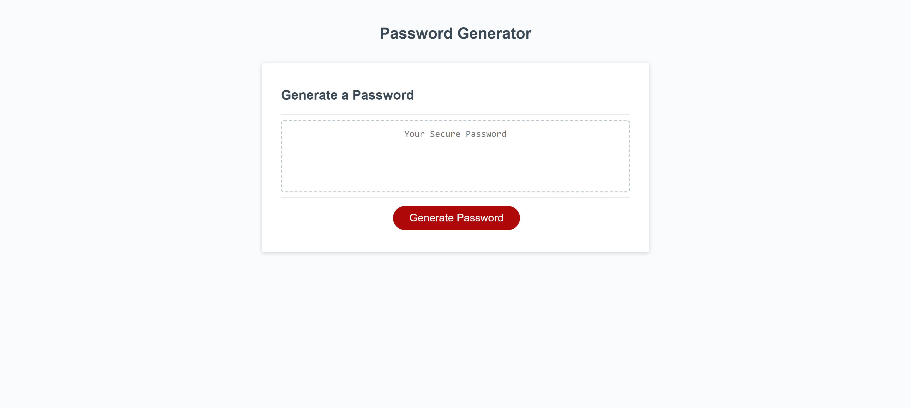

# password-generator

## Description

This password generator was created as a way for a user to input the length and type of password, to receive a random combination of characters created by this site. I built this project because it is important to have safe passwords and this random generator makes that easy. With the technology that exists, it is not uncommon for information to be hacked and stolen. The best way to prevent that is to use passwords that are unique. The strongest passwords consist of at least one number, special charatcer, uppercase letter, and lowercase letter. They also should be at least eight characters. This password generator ensures that the user has the option to include each of those items. While creating this project,  I learned about safe passwords and how to apply javascript to a website to give it a unique function. 

## Installation
N/A

## Usage

To use this website, select a password length between 8 and 128 characters. Then, you will be asked to confirm whether or not you would like uppercase characters, lowercase characters, special characters, or numbers in the password. To choose "yes", select the "Ok" button. To choose "no", select the "Cancel" button.

https://bcolo24.github.io/password-generator/

https://github.com/bcolo24/password-generator.git

## Credits
This youtube video from Traversy Media helped me while creating this project:

https://www.youtube.com/watch?v=duNmhKgtcsI&t=788s&pp=ygUhdHJhdmVyc3kgbWVkaWEgcGFzc3dvcmQgZ2VuZXJhdG9y

## License

MIT License

Copyright (c) 2023 bcolo24

Permission is hereby granted, free of charge, to any person obtaining a copy
of this software and associated documentation files (the "Software"), to deal
in the Software without restriction, including without limitation the rights
to use, copy, modify, merge, publish, distribute, sublicense, and/or sell
copies of the Software, and to permit persons to whom the Software is
furnished to do so, subject to the following conditions:

The above copyright notice and this permission notice shall be included in all
copies or substantial portions of the Software.

THE SOFTWARE IS PROVIDED "AS IS", WITHOUT WARRANTY OF ANY KIND, EXPRESS OR
IMPLIED, INCLUDING BUT NOT LIMITED TO THE WARRANTIES OF MERCHANTABILITY,
FITNESS FOR A PARTICULAR PURPOSE AND NONINFRINGEMENT. IN NO EVENT SHALL THE
AUTHORS OR COPYRIGHT HOLDERS BE LIABLE FOR ANY CLAIM, DAMAGES OR OTHER
LIABILITY, WHETHER IN AN ACTION OF CONTRACT, TORT OR OTHERWISE, ARISING FROM,
OUT OF OR IN CONNECTION WITH THE SOFTWARE OR THE USE OR OTHER DEALINGS IN THE
SOFTWARE.